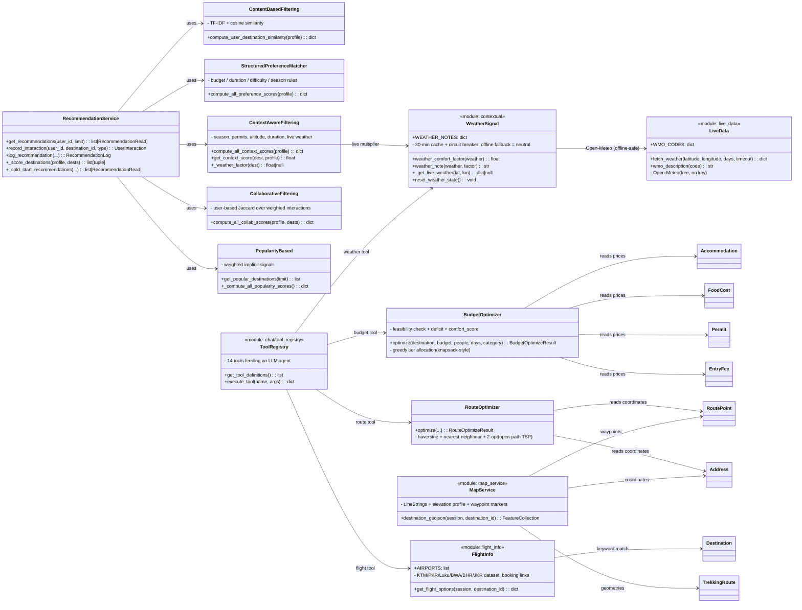

# Mermaid Diagrams & Analysis

**Source**: All files in `app/` (models, services, routers, chat), plus deployment config.

## Part 1 — Data model

**Total Classes**: 23 SQLModel tables
**Total Enums**: 9 enums

### Diagram (models)

```mermaid
classDiagram
    class User {
        +id: UUID
        +name: str
        +role: UserRole
        +nationality: str|null
        +email: EmailStr
        +phone: str|null
        +created_at: datetime
        +updated_at: datetime
    }
    class UserRole {
        <<enumeration>>
        +traveler: "traveler"
        +guide: "guide"
        +admin: "admin"
    }
    class PaceType {
        <<enumeration>>
        +slow: "slow"
        +normal: "normal"
        +fast: "fast"
    }
    class BudgetType {
        <<enumeration>>
        +budget: "budget"
        +standard: "standard"
        +luxury: "luxury"
    }
    class TripStatus {
        <<enumeration>>
        +planned: "planned"
        +ongoing: "ongoing"
        +completed: "completed"
    }
    class UserTrip {
        +id: UUID
        +user_id: UUID
        +destination_id: UUID
        +route_id: UUID
        +pace_type: PaceType
        +budget_type: BudgetType
        +start_date: date|null
        +end_date: date|null
        +status: TripStatus
    }
    class Itinerary {
        +id: UUID
        +trip_id: UUID
        +day_number: int
        +start_location: str
        +end_location: str
        +overnight_location: str|null
        +estimated_walking_hours: Decimal|null
        +notes: str|null
    }
    class SavedDestination {
        +id: UUID
        +user_id: UUID
        +destination_id: UUID
        +created_at: datetime
    }
    class DestinationCategory {
        <<enumeration>>
        +attraction: "attraction"
        +trek: "trek"
    }
    class Destination {
        +id: UUID
        +name: str
        +category: DestinationCategory
        +description: str
        +best_time: list
        +permit_required: bool
        +rating: int|null
        +created_at: datetime
        +address_id: UUID
    }
    class Address {
        +id: UUID
        +province: str|null
        +district: str|null
        +place: str|null
        +latitude: float|null
        +longitude: float|null
        +altitude: float|null
    }
    class TrekkingRoute {
        +id: UUID
        +destination_id: UUID
        +route_name: str
        +difficulty: Difficulty
        +total_distance_km: Decimal|null
        +recommended_days: int|null
        +max_altitude: int|null
        +description: str|null
    }
    class Difficulty {
        <<enumeration>>
        +easy: "easy"
        +moderate: "moderate"
        +hard: "hard"
    }
    class RoutePoint {
        +id: UUID
        +route_id: UUID
        +sequence_no: int
        +name: str
        +distance_from_previous_km: Decimal|null
        +walking_hours_from_previous: Decimal|null
        +overnight_stop: bool
        +description: str|null
        +address_id: UUID
        +accommodation_id: UUID|null
        +food_cost_id: UUID|null
    }
    class Accommodation {
        +id: UUID
        +budget_price: Decimal
        +standard_price: Decimal|null
        +luxury_price: Decimal|null
    }
    class FoodCost {
        +id: UUID
        +budget_price: Decimal
        +standard_price: Decimal|null
        +luxury_price: Decimal|null
    }
    class AttractionType {
        <<enumeration>>
        +temple: "temple"
        +heritage: "heritage"
        +hiking: "hiking"
        +lake: "lake"
        +viewpoint: "viewpoint"
    }
    class Attraction {
        +id: UUID
        +destination_id: UUID
        +attraction_types: list
        +opening_hours: str|null
        +visit_duration_hours: Decimal|null
    }
    class EntryCategory {
        <<enumeration>>
        +nepali: "Nepali"
        +saarc: "SAARC"
        +foreign: "Foreign"
    }
    class EntryFee {
        +id: UUID
        +attraction_id: UUID
        +category: EntryCategory
        +price: Decimal
    }
    class PermitCategory {
        <<enumeration>>
        +nepali: "Nepali"
        +saarc: "SAARC"
        +foreign: "Foreign"
    }
    class Permit {
        +id: UUID
        +destination_id: UUID
        +category: PermitCategory
        +price: Decimal
    }
    class Photo {
        +id: UUID
        +destination_id: UUID
        +uploaded_by: UUID
        +image_url: str
        +caption: str|null
    }
    class Review {
        +id: UUID
        +user_id: UUID
        +destination_id: UUID
        +rating: int
        +comment: str|null
        +created_at: datetime
        +UNIQUE(user_id, destination_id)
    }
    class Blog {
        +id: UUID
        +title: str
        +slug: str
        +content: str
        +excerpt: str|null
        +author_id: UUID|null
        +featured_image: str|null
        +category: str|null
        +tags: list|null
        +is_published: bool
        +published_at: datetime|null
        +created_at: datetime
        +updated_at: datetime
    }
    class ChatConversation {
        +id: UUID
        +user_id: UUID
        +title: str
        +created_at: datetime
        +updated_at: datetime
    }
    class ChatMessage {
        +id: UUID
        +conversation_id: UUID
        +role: str
        +content: str
        +created_at: datetime
    }
    class DestinationItinerary {
        +id: UUID
        +destination_id: UUID
        +day_number: int
        +title: str|null
        +start_location: str
        +end_location: str
        +overnight_location: str|null
        +estimated_walking_hours: Decimal|null
        +notes: str|null
    }
    class ActivityLog {
        +id: UUID
        +user_id: UUID
        +user_name: str
        +action: str
        +target: str
        +type: str
        +created_at: datetime
    }
    class UserPreferences {
        +user_id: UUID (PK, FK to users)
        +preferred_categories: list
        +preferred_activities: list
        +budget_preference: str|null
        +typical_duration: int|null
        +difficulty_preference: str|null
        +preferred_season: list
        +travel_style: str|null
        +updated_at: datetime
    }
    class UserInteraction {
        +id: UUID
        +user_id: UUID
        +destination_id: UUID
        +interaction_type: str
        +rating: int|null
        +created_at: datetime
        +INDEX(user_id, destination_id, interaction_type)
    }
    class RecommendationLog {
        +id: UUID
        +user_id: UUID
        +destination_id: UUID
        +final_score: float
        +component_scores: dict
        +algorithm_version: str
        +created_at: datetime
    }

    User ||--o{ UserTrip : trips
    User ||--o{ Photo : photos
    User ||--o{ Review : reviews
    User ||--o{ ChatConversation : chat_conversations
    User ||--o{ Blog : blogs
    User ||--o{ UserInteraction : interactions
    User ||--o{ RecommendationLog : recommendation_logs
    User ||--o{ UserPreferences : preferences

    UserTrip ||--o{ User : user
    UserTrip ||--o{ Destination : destination
    UserTrip ||--o{ TrekkingRoute : route
    UserTrip ||--o{ Itinerary : itineraries

    SavedDestination ||--o{ User : user
    SavedDestination ||--o{ Destination : destination

    Destination ||--o{ UserTrip : user_trips
    Destination ||--o{ TrekkingRoute : trekking_routes
    Destination ||--o{ Permit : permits
    Destination ||--o{ Photo : photos
    Destination ||--o{ Review : reviews
    Destination ||--o{ SavedDestination : saved_destinations
    Destination ||--o{ DestinationItinerary : destination_itineraries
    Destination ||--o{ UserInteraction : interactions
    Destination ||--o{ RecommendationLog : recommendation_logs

    TrekkingRoute ||--o{ RoutePoint : route_points

    Address ||--o{ RoutePoint : route_points
    Address ||--o{ Destination : destinations

    RoutePoint ||--o{ Accommodation : accommodation
    RoutePoint ||--o{ FoodCost : food_cost
    RoutePoint ||--o{ Address : address

    Attraction ||--o{ EntryFee : entry_fees

    Blog ||--o{ User : author

    ChatConversation ||--o{ ChatMessage : messages

    DestinationItinerary ||--o{ Destination : destination

    ActivityLog ||--o{ User : user_id (FK)
```

---

## Part 2 — Intelligence & services layer

**Scorers**: 5 (content, preference, context, collaborative, popularity) — blended
`0.35 / 0.20 / 0.20 / 0.15 / 0.10`.
**Optimizers**: 2 (budget, route).
**Live-data modules**: 3 (weather, flights, offline map).
**Chat tools**: 14 (registry).

### Diagram (services)



### How the pieces fit

1. **RecommendationService** is the orchestrator: it loads the user profile, runs the
   five scorers, blends them with the hybrid weights, excludes saved/tripped
   destinations, and appends a **live-weather note** to the explanation when one exists.
2. **ContextAwareFiltering** adds the live-weather multiplier via **WeatherSignal**
   (temperature comfort + 3-day rain probability). Lookups are cached 30 min and a
   circuit breaker disables them for 5 min after any failure — so the whole pipeline
   is **offline safe** and falls back to the static season score.
3. **BudgetOptimizer** greedily upgrades budget → standard → luxury tiers
   (accommodation per room/night + food per person/day + one-time permits/entry fees
   by category) while staying under `total_budget`; returns feasibility, deficit,
   per-day plan and a comfort score.
4. **RouteOptimizer** applies Haversine + nearest-neighbour (from every start) +
   2-opt to reorder waypoints, returning km/% savings over the original order.
5. The **ToolRegistry** exposes these systems (plus destinations, attractions,
   accommodation, trek routes/food costs, permits, weather, flights) as 14 tools the
   local LLM agent can call — it never invents data.

---

## Detected Structure

**Model classes (23)**
- User, UserTrip, Itinerary, SavedDestination, UserPreferences, UserInteraction, RecommendationLog
- Destination, Address, TrekkingRoute, RoutePoint
- Accommodation, FoodCost, Attraction, EntryFee, Permit, Photo, Review
- Blog, ChatConversation, ChatMessage, DestinationItinerary, ActivityLog

**Enums (9)**
- UserRole (traveler, guide, admin)
- PaceType (slow, normal, fast)
- BudgetType (budget, standard, luxury)
- TripStatus (planned, ongoing, completed)
- DestinationCategory (attraction, trek)
- Difficulty (easy, moderate, hard)
- EntryCategory (Nepali, SAARC, Foreign)
- PermitCategory (Nepali, SAARC, Foreign)
- AttractionType (temple, heritage, hiking, lake, viewpoint)

**Main Relationships** (using `||--o{` Mermaid convention where `||`=1 and `o{`=0-or-many):

1. **User** → **UserTrip** (trips): User has many UserTrips
2. **User** → **Photo** (photos): User has many photos
3. **User** → **Review** (reviews): User has many reviews
4. **User** → **ChatConversation** (chat_conversations): User has many chat conversations
5. **User** → **Blog** (blogs): User has many blogs
6. **User** → **UserInteraction**: 0..N interactions (view/click/save/rating/...)
7. **User** → **RecommendationLog**: 0..N logged recommendations received
8. **User** → **UserPreferences**: one settings row per user (PK = user_id FK)
9. **UserTrip** → **User / Destination / TrekkingRoute / Itinerary**
10. **SavedDestination** → **User / Destination**
11. **Destination** → **UserTrip, TrekkingRoute, Permit, Photo, Review, SavedDestination, DestinationItinerary, UserInteraction, RecommendationLog**
12. **TrekkingRoute** → **RoutePoint**
13. **Address** → **RoutePoint / Destination**
14. **RoutePoint** → **Accommodation / FoodCost / Address** (accommodation & food optional)
15. **Attraction** → **EntryFee**
16. **Blog** → **User** (author, optional)
17. **ChatConversation** → **ChatMessage** (CASCADE on delete)
18. **DestinationItinerary** → **Destination**
19. **ActivityLog** → **User** (FK-only association)

**Intelligence / services layer**
- 5 scorers + hybrid weighting (see Part 2), cold-start path for new users.
- 2 optimizers (budget, route), 3 live-data modules (weather, flights, offline map).
- 14 chat tools in the registry; LLM runs locally via Ollama.
- Live weather with automatic offline fallback (`WEATHER_MODE=auto`).

**Notes / uncertainties**

1. **AttractionType enum** is defined but the `Attraction.attraction_types` field is a
   JSON list, not a typed relationship.
2. **ActivityLog** uses a plain `Field(foreign_key=...)` — a FK constraint, not a
   SQLModel `Relationship` (shown as `||--o{` loosely).
3. **RoutePoint.accommodation_id / food_cost_id** are optional — cardinality is "0 or 1".
4. **Blog.author** is optional ("zero or one").
5. **No many-to-many junction tables** — all relations are 1-to-1 or 1-to-many.
6. **UserInteraction** adds a composite index on (user_id, destination_id, interaction_type);
   **Review** enforces a unique (user_id, destination_id) constraint.
7. **UserPreferences.user_id** doubles as the primary key (one row per user).

---

*Generated by analyzing the `app/` directory plus the intelligence/services layer.
The diagrams above can be rendered at https://mermaid.live/; the raw version is at
`backend/mermaid_diagram.mmd`.*