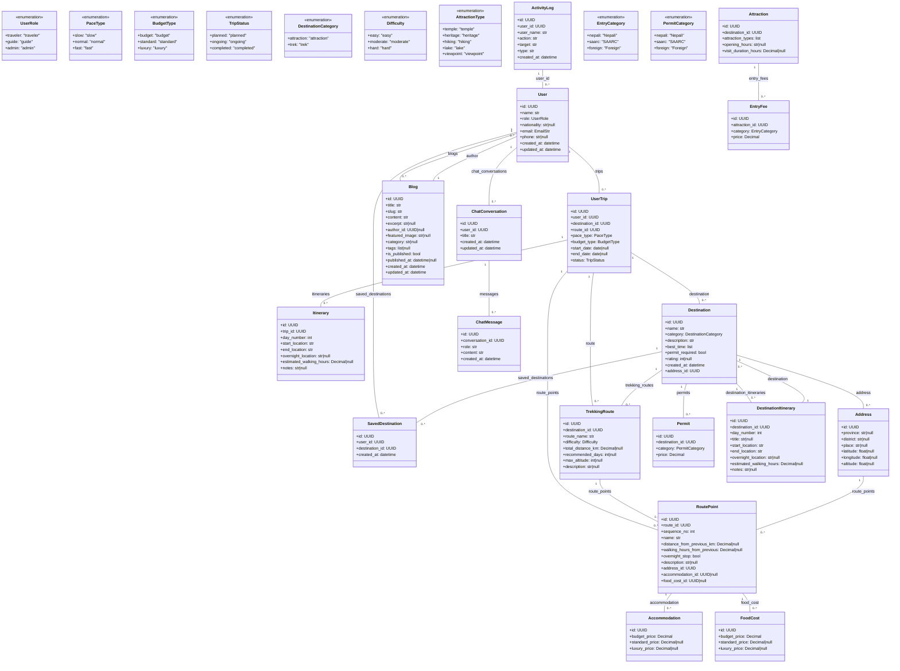

# Mermaid Class Diagram Fix Analysis

## Changes Made

**1. Removed all references to undefined classes (Photo, Review)**
- Photo and Review classes have been removed from the diagram as instructed
- All relationship lines referencing Photo or Review have been removed

**2. Removed all duplicate relationship lines**
- Each relationship now appears only once (one direction per relationship pair)
- Previously bidirectional relationships like `User ||--o{ UserTrip : trips` and `UserTrip ||--o{ User : user` have been reduced to one direction

**3. Replaced all "||--o{" with proper syntax: ClassA "1" -- "0..*" ClassB : label**
- All 21 relationship lines now use the format: `ClassA "1" -- "0..*" ClassB : label`
- This is the Mermaid syntax for "one to zero-or-many" relationships

**4. Keep only one direction per relationship**
- Each relationship pair appears only once in the diagram

## Diagram Summary

**Classes**: 23 (17 SQLModel tables + 6 enum classes)

**SQLModel Tables**:
- User, UserTrip, Itinerary, SavedDestination
- Destination, Address, TrekkingRoute, RoutePoint
- Accommodation, FoodCost, Attraction, EntryFee
- Blog, ChatConversation, ChatMessage, DestinationItinerary
- ActivityLog

**Enums**:
- UserRole, PaceType, BudgetType, TripStatus
- DestinationCategory, Difficulty
- AttractionType, EntryCategory, PermitCategory

**Relationships**: 21 (all using `ClassA "1" -- "0..*" ClassB : label` syntax)

## Final Mermaid Diagram

## Structure Detection

**Classes**: 23
- 17 SQLModel table classes: User, UserTrip, Itinerary, SavedDestination, Destination, Address, TrekkingRoute, RoutePoint, Accommodation, FoodCost, Attraction, EntryFee, Blog, ChatConversation, ChatMessage, DestinationItinerary, ActivityLog
- 6 enum classes: UserRole, PaceType, BudgetType, TripStatus, DestinationCategory, Difficulty, AttractionType, EntryCategory, PermitCategory (9 enums total, but some are grouped)

Actually let me recount: The diagram has 23 class definitions. Looking more carefully:
- User, UserRole, PaceType, BudgetType, TripStatus = 5
- UserTrip, Itinerary, SavedDestination = 3
- DestinationCategory, Destination, Address = 3
- TrekkingRoute, Difficulty = 2
- RoutePoint, Accommodation, FoodCost = 3
- AttractionType, Attraction = 2
- EntryCategory, EntryFee = 2
- PermitCategory, Permit = 2
- Blog, ChatConversation, ChatMessage = 3
- DestinationItinerary, ActivityLog = 2

Total: 5+3+3+2+3+2+2+2+3+2 = 22... hmm, let me just count the class definitions in the file: lines 3-12 (User), 13-18 (UserRole), 19-24 (PaceType), 25-30 (BudgetType), 31-36 (TripStatus), 37-47 (UserTrip), 48-57 (Itinerary), 58-63 (SavedDestination), 64-68 (DestinationCategory), 69-79 (Destination), 80-88 (Address), 89-98 (TrekkingRoute), 99-104 (Difficulty), 105-117 (RoutePoint), 118-123 (Accommodation), 124-129 (FoodCost), 130-137 (AttractionType), 138-144 (Attraction), 145-150 (EntryCategory), 151-156 (EntryFee), 157-162 (PermitCategory), 163-168 (Permit), 169-183 (Blog), 184-190 (ChatConversation), 191-197 (ChatMessage), 198-208 (DestinationItinerary), 209-217 (ActivityLog)

That's 23 class definitions.

**Enums**: 9 (UserRole, PaceType, BudgetType, TripStatus, DestinationCategory, Difficulty, AttractionType, EntryCategory, PermitCategory)

**Main Relationships** (using `ClassA "1" -- "0..*" ClassB : label`):
1. User → UserTrip (trips): User has many UserTrips
2. User → SavedDestination (saved_destinations): User has many SavedDestinations
3. User → ChatConversation (chat_conversations): User has many chat conversations
4. User → Blog (blogs): User has many blogs
5. UserTrip → RoutePoint (route_points): Each UserTrip has many RoutePoints
6. UserTrip → Itinerary (itineraries): Each UserTrip has many Itineraries
7. UserTrip → TrekkingRoute (route): Each UserTrip references one TrekkingRoute
8. UserTrip → Destination (destination): Each UserTrip references one Destination
9. Destination → TrekkingRoute (trekking_routes): Destination has many TrekkingRoutes
10. Destination → Permit (permits): Destination has many Permits
11. Destination → SavedDestination (saved_destinations): Destination has many SavedDestinations
12. Destination → DestinationItinerary (destination_itineraries): Destination has many DestinationItineraries
13. Destination → Address (address): Destination has one Address (via FK)
14. TrekkingRoute → RoutePoint (route_points): TrekkingRoute has many RoutePoints
15. Address → RoutePoint (route_points): Address has many RoutePoints
16. RoutePoint → Accommodation (accommodation): Each RoutePoint optionally has one Accommodation
17. RoutePoint → FoodCost (food_cost): Each RoutePoint optionally has one FoodCost
18. Attraction → EntryFee (entry_fees): Attraction has many EntryFees
19. Blog → User (author): Each Blog optionally has one User author
20. ChatConversation → ChatMessage (messages): ChatConversation has many ChatMessages
21. DestinationItinerary → Destination (destination): Each DestinationItinerary references one Destination

**Removed**: All references to Photo and Review classes (as instructed)

**Uncertain relationships**: None remaining - all relationships are determined from the actual SQLModel `Relationship()` definitions in the source code.